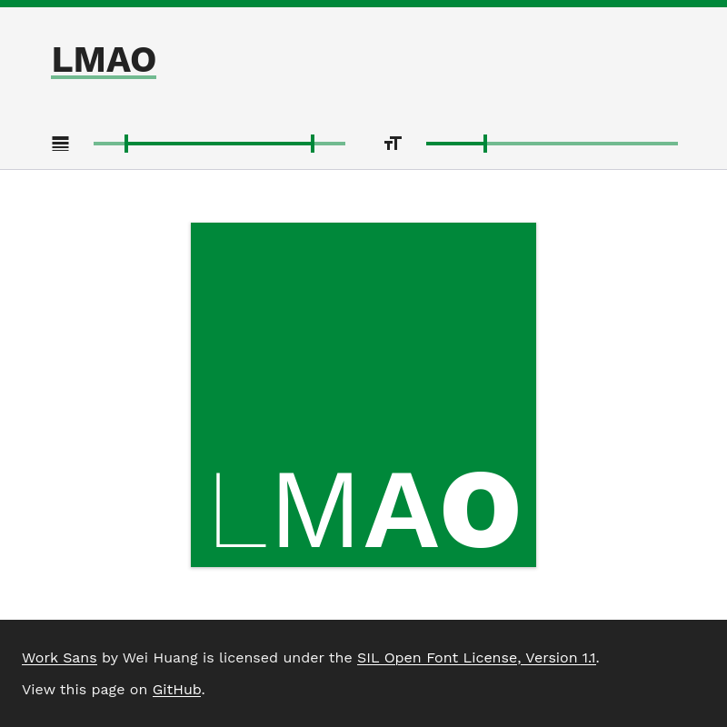

#  Variable Font Demo

Demonstration of (continuously) variable fonts using [Work Sans](https://github.com/weiweihuanghuang/Work-Sans) by Wei Huang. Any resemblance to the [logo](https://www.lmu.de/de/die-lmu/struktur/zentrale-universitaetsverwaltung/kommunikation-und-presse/lmu-brand-guide/designgrundsaetze/logo/index.html) of the Ludwig Maximilian University of Munich is purely coincidental.

Demo is available at https://just-max.github.io/variable-font-demo/.

## How Does It Work?

We can use a [variable font](https://developer.mozilla.org/en-US/docs/Web/CSS/CSS_Fonts/Variable_Fonts_Guide) such as Work Sans and adjust the weight (`wght`) variation axis to continuously vary the line weight of the glyphs.
https://wakamaifondue.com/

## Licence

Copyright 2019 The Work Sans Project Authors. Licensed under the terms of the SIL Open Font License, Version 1.1. This licence is copied in [`OFL`](/OFL).

The remaining files are licensed under the Mozilla Public License, Version 2.0. This licence is copied in [`LICENCE`](/LICENCE).

## Components

- All two icons on the page are from [Material Icons](https://fonts.google.com/icons)
- For adapting the bottom margin to the descender height [opentype.js](https://opentype.js.org/) is used to parse the font file.
- Sliders are made with [noUiSlider](https://refreshless.com/nouislider/).
